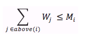

#5. 알고리즘의  정당성 증명

## 5.1 도입
- 알고리즘 증명을 위해서는 각종 수학적 기법이 동원되어야 한다.
- 알고리즘 증명의 이유
	- 증명이 알고리즘 유도하는 데 결정적인 통찰을 담고 있기 때문(공부가 된다)
	- 다른 알고리즘들의 증명을 공부하다 보면 나중에 자신이 설계한 알고리즘의 정당성을 더 쉽게 증명 할 수 있다


## 5.2 수학적 귀납법과 반복문 불변식
1. 단계 나누기
	- 증명하고 싶은 사실을 여러 단계로 나누기(ex: 도미도 블럭 나누기)
2. 첫 단계 증명
	- 첫 단계가 성립함을 보임(ex: 첫 도미노가 넘어진다)
3. 귀납 증명
	- 한 단계가 성립하면 다음단계도 성립함을 보임(ex: 도미노가 쓰러지면 다음 도미노가 반드시 쓰러짐을 보인다)

사다리 게임을 귀납법으로 증명 ( 맨위의 선택지와 맨 아래 선택지가 언제나 1:1 대응한다)

-

### 반복문 불변식(loop invariant)
반복문의 내용이 한 번 실행될 때마다 중간 결과가 우리가 원하는 답으로 가는 길 위에 잘 있는지를 명시하는 조건 

- 불변식을 이용한 정당성 증명
	1. 반복문 진입시에 불변식이 성립함을 보인다.
	2. 반목문 내용이 시작할때 불변식이 성립했다면 내용이 끝날 때도 불변식이 항상 성립함을 보인다.
	3. 반복문 종료시에 불변식이 성립하면 항상 우리가 정답을 구했음을 보인다.

```
int binsearch(int [] A, int x) {
	int n = A.size();
	int lo = -1, hi = n;
	
	//불변식1 : lo < hi
	//불변식2 : A[lo] < x <= A[hi]
	while(lo +1 < hi) {
		int mid = (lo + hi) /2;

		if(A[mid] < x)
			lo = mid;
		else
			hi = mid;
	}

}
```

반복문이 계속될수록 두개의 불변식은 유지된다.
불변식을 증명하는 과정은 귀납법과 다를것이 없다. 전체 작업을 각 단계로 나누는 과정이 이미 반복문으로 나타나 있으니 더 간단할 수 있다.
다음과 같은 과정으로 증명한다

1. 초기조건
	- 초기의 조건에 따라 해당 하는 불변식이 성립하는지 확인
2. 유지조건
	- 반복문이 돌아감에 따라 불변식이 깨지지 않음을 보임


### 단정문을 이용해 반복문 불변식 강제하기
불변식이 깨어졌을 때 프로그램이 강제 종료되도록 하면 불변식의 유지에 문제가 있다는 사실을 쉽게 알 수있다. 그러나 단정문도 어느 정도 속도에 지장을 주기 때문에 많이 실행되는 반목문 안에 단정문을 배치하는 것을 삼가는 것이 좋다.


## 5.3 귀류법
- 우리가 원하는 바와 반대되는 상황을 가정하고 논리를 전개해서 결론이 잘못됐음을 찾아내느 증명기법

### 책장 쌓기
상자 형태로 된 책장을 여러 개 쌓아올리려고 한다. 각 책장마다 버틸 수 있는 최대무게 Mi와 자신의 무게 Wi 가 주어진다고 하자. 이때 책장을 가장 높이 쌓는다면 몇 개나 쌓을 수 있을까? 단 above(i) 가 i번 책장 위에 쌓인 모든 책장의 집합이라고 할때, 다음이 성립한다.



책장 위에 올라간 다른 책장들의 무게의 합이 견딜 수 있는 최대 무게를 초과하며 안된다는 말이다.
이 문제는 Mi + Wi 가 가장큰 순서대로 아래에 놓으면 해결된다. 이 답을 귀류법을 통해 증명해 보자.

귀류법을 쓰기 위해서는 증명하려는 사실의 반대를 가정해야 한다. 어떤 입력의 최적해를 구했는데 Mi+Wi 가 더큰 쟁장 A가  더 작은 B 위에 올라간 형태라고 가정하자. 합이 큰 것부터 아래에 놓아야 하는데 A가 B 위에 올라가 있으니 이것은 우리가 원하는 것과 반대되는 것이다. 이때 A와 B의 위치를 바 꿀 수 있음을 증명해 보자. 이것이 가능하다면 우리가 원하는 답이 최선일 수 있다는 증거가 된다. B 는 윗칸으로 올라가니 견뎌야 할 무게가 더 줄어들고, 반드시 위에 올 릴 수 있다.  그러나 그존에 위에있던 상자의 무게에 B의 무게를 더해 A 가 견딜 수 있느냐가 관건이다.

MA + WA > MB + WB 에서 MA 만 좌변에 남겨 보자

	MA > MB + WB - WA

A 위에 올라가 있는 상자들의 무게의 합을 X라 할 때, 가장 좋은 답에서 A가 B위에 올라갔으니 MB >= WA + X 임을 알 수 있다.  이것을 위의 식과 합쳐보면

	MA > MB + WB - WA >= (WA + X) + WB - WA
	
맨 ㅇ오른 쪽의 WA들이 더하고 빠지면 다음 식만 남는다.

MA > X + WB	

이 말은 A도 B와 나머지 모든 상자들을 지탱 할 수 있다는 말이다. 따라서 우리가 원하는 순서대로 쌓았을 때 가장 높은 탑을 얻지 못하는 경우는 존재하지 않는다는 것을 알 수 있다.

### 알고리즘을 이용한 증명들
알고리즘의 결과가 최선임을 보이기 위해 각 단계에서 최선의 선택을 함을 귀류법으로 증명하고, 각 단계에서 최선의 선택을 한다면 다음 단계에서도 최선의 선택을 할 수 있음을 귀납법으로 증명하는 것이다.


## 5.4 다른 기술들
### 비둘기기집의 원리
10마리의 비둘기가 9개의 비둘기집에 모두 들어갔다면, 2마리 이상이 들어간 비둘기집이 반드시 하나는 존재한다.
	
### 동전뒤집기
100개의 동전이 바닥에 깔려 있는데 이 중 F개는 앞면 100-F개는 뒷면이 위로 놓여있다. 이 동전을 모두 앞면을 위로하고 싶은데, 한 번 뒤집을 때 반드시 X개의 동전을 한꺼번에 뒤집어야 한다. 같은 동전을 두 번 이상 뒤집는 것도 상관없다. 이때  뒤집는 횟수를 최소화 하고 싶다. 이 답의 상한은 얼마일까?
답은 100 이다. 

### 순환 소수 찾기
분수 a/b가 주어질 때 실수 연산을 쓰지 않고 이 분수를 소수 형태로 출력하려한다. 

```
void printDecimal(int a, int b) {
	int iter = 0;
	while(a > 0) {
		if(iter++ == 1) cout << '.';
		cout << a / b;
		a = (a % b) * 10;
	}
}
```
이를 위해 위 함수를 사용해야한다. 그런데 1/11과 같이 입력이 주어지면 0.0909090909 로 무한히 반복되므로 이 숫자가 무한소수라는 사실을 알아야 한다.
비둘기 집의 원리를 쓰면 이 문제를 쉽게 해결할 수 있다. a % b의 결과는 언제나 [0, b-1] 범위의 값을 갖는다. while문이 b_1번 반복될 때까지 함수가 종료하지 않았다고 하면, a % b의 결과는 b 가지의 결과만 가질 수 있으니 결과가 중복되는 경우는 반드시 존재한다. 그러면 같은결과가 첫 번째로 등장했을 때부터 두번째 등장할 때까지가 무한히 순환되는 순환 소수임을 알 수 있다.

### 구성적 증명(constructive proof)
구성적 증명은 답의 실제예를 들거나 답을 만드는 방법을 실제로 제시하는 증명법(다른 방법은 답이 존재한다는 것을 논증하는 것과 비교 됨)

